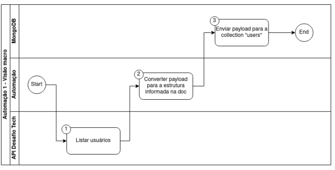
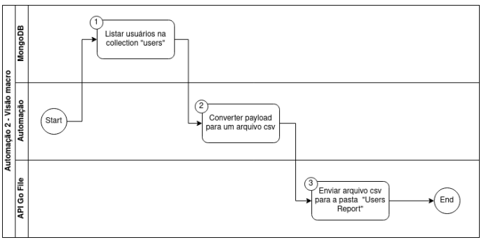

# Desafio Técnico LinkApi
## Instruções
- Leia atentamente as instruções abaixo para realização do teste proposto.
- Desenvolva e versione os projetos usando git.
- Utilize o GitHub para hospedar o código em um repositório privado.
- Crie a documentação de como executar e consumir seu projeto.
- Compartilhe este repositório privado com o e-mail people@linkapi.com.br.
- Enviar o link do repositório para people@linkapi.com.br.

## ⚠ IMPORTANTE - CRITÉRIOS DE DESCLASSIFICAÇÃO ⚠

- O teste em questão deve ser feito utilizando a engine NodeJS (Vanilla JavaScript ou
TypeScript), caso contrário, o candidato será desclassificado automaticamente. Recomendamos evitar o uso do framework Nest.js.
- O repositório deve estar com o compartilhamento privado, caso contrário, o candidato será
desclassificado automaticamente.

# O que será avaliado?
- Requisitos realizados.
- Desacoplamento de código.
- Legibilidade de código.
- Boas práticas de desenvolvimento de API RESTful, utilize os links enviados como referência para aplicá-las em seu projeto.
- Mapeamento dos campos.
- Modelagem de dados.
- Tratamento de erros das aplicações.
- Performance das aplicações.
- Arquitetura adotada no desenvolvimento das aplicações.
- Documentação das aplicações.
- Exposição de dados sensíveis no código.
- Agendamento de rotinas.
- Logs das aplicações.
- Testes unitários ou de integração.
- Recursos de paginação.

# Projeto 1 - Automação de Conversão

### Objetivo
Desenvolvimento de uma automação agendada em NodeJs para realizar o consumo de dados dos usuários
em uma API, converter a estrutura de cada usuário e enviá-lo para um banco de dados MongoDB na
collection “users“.
### Fluxograma



## Requisitos
1. Criar automação com as regras de negócio e funcionalidade dos steps posteriores.
2. Seu script deverá inicialmente realizar a busca de todos os usuários na API mencionada no final da
descrição deste projeto, através da rota "/users".
3. Com a resposta da requisição anterior, deverá ser criado um subprocesso para cada usuário
retornado.
4. Converter a estrutura de cada usuário para a estrutura abaixo:
```json
{
 "fullName": "Kapi Kaperson",
 "email": "kapi.kapeira@gmail.com",
 "address": "Rua das Kapivaras",
 "addressNumber": 123,
 "phoneNumber": "941-123-555"
}
```
5. Criar banco de dados MongoDB.
6. Feito isso deverá ser criada uma collection chamada "users" para inclusão dos usuários.
7. Para cada conversão, realizar a inserção dos dados do usuário na collection "users". Não será permitido a inclusão de usuários já existentes no banco.
8. Ao final do processamento de todos os usuários deverá ser programado o envio de um e-mail contendo um report dos usuários processados pela rotina. Anexe ao seu repositório evidências do envio do e-mail.

## Pontos de atenção
- Para a criação do banco de dados MongoDB, é preferível a utilização de Docker mas existem serviços
como MongoDB Atlas para criação de uma instancia gratuitamente que atendem a este requisito.
- Documentação da API Mencionada: Desafio Tech - API Docs (https://linkapi-desafio-tech.gateway.linkapi.solutions/v1/docs)
- A API em questão possui recursos de paginação (parâmetros page e limit) e rate limit de 30 reqs/min.
- A API possui autenticação do tipo Basic, para a geração do token deverão ser utilizados o usuário e senha enviado por e-mail pelo nosso time.
- A automação precisa ser resiliente a falhas de execução.


# Projeto 2 - Automação de envio de arquivos
### Objetivo
Desenvolvimento de uma automação agendada em NodeJs para realizar o envio de arquivos gerados a
partir dos documentos populados no projeto anterior.
### Fluxograma



### Requisitos
1. Criar automação com as regras de negócio e funcionalidade dos steps posteriores.
2. Seu script deverá inicialmente realizar a busca de todos os usuários na collection "users" do
MongoDB.
3. Com a resposta da busca anterior deverá ser criado um arquivo csv com as seguintes colunas "id",
"fullName" e "email".
4. Mandar o arquivo csv gerado para o GoFile, em uma pasta nomeada por "Users Report"


## Pontos de atenção
- Para utilizar os recursos da API do GoFile, é necessária a criação de uma conta utilizando e-mail.
- A documentação da API GoFile pode ser encontrada em GoFile - API Docs (https://gofile.io/api).
- A automação precisa ser resiliente a falhas de execução.

# Projeto 3 - API GATEWAY
### Objetivo
Desenvolvimento de uma automação agendada em NodeJs para realizar o envio de arquivos gerados a
partir dos documentos populados no projeto anterior.

### Endpoints

- Endpoint: Criar pastas

Este endpoint deverá receber um nome de pasta, realizar a criação da mesma na GoFile e armazenar o
nome e id da pasta criada no banco de dados MongoDB na collection "Folders".

- Endpoint: Upload de arquivo

Este endpoint deverá receber um arquivo qualquer e o nome da pasta onde será salvo, e fazer o upload do
mesmo na pasta em questão no GoFile, armazenando nome, id do arquivo, id da pasta e conteúdo do arquivo gerados na
collection "Files". 

- Endpoint: Deleção de arquivo

Este endpoint deverá receber o nome da pasta e o nome do arquivo e deve excluir o mesmo da GoFile.

- Endpoint: Busca de arquivos

Este endpoint deve retornar todos os arquivos armazenados do MongoDB da collection "Files".


## Pontos de atenção:

- Caso o usuário passe um nome de pasta que ainda não foi criada, através da rota de criação de pastas,
retornar um erro solicitando que o mesmo execute esta operação. Mesma regra se aplica ao arquivo.
- O endpoint de busca de arquivos vai ser bastante utilizado sendo necessário performance no tempo de retorno das informações.
- Não se preocupem com o aviso de ser necessário uma conta premium para acessar os recursos da API GoFile, basta apenas criar uma conta gratuita que já é possível acessar os recursos.

### Links que podem ser úteis no desenvolvimento:

- https://refactoring.guru/design-patterns
- https://semantix.ai/primeiros-passos-em-api-gateway/
- https://semantix.ai/como-chegar-ao-nivel-supremo-de-apis-restful/
- https://semantix.ai/politicas-em-apis-restful/
- https://semantix.ai/seguranca-em-apis-restful/
- https://semantix.ai/performance-em-apis-restful-cache-compressao-e-mais/
- https://semantix.ai/api-restful-o-que-voce-precisa-saber-sobre-metodos-e-codigos-de-status-do-protocolo-http/
- https://semantix.ai/a-anatomia-de-uma-api-restful/
- https://semantix.ai/paginacao-ordenacao-e-filtros-em-apis-restful/
- https://www.freecodecamp.org/portuguese/news/streams-em-node-js-tudo-o-que-voce-precisa-saber/
- https://blog.logrocket.com/caching-node-js-optimize-app-performance/
- https://www.luiztools.com.br/post/como-criar-um-cache-de-dados-com-redis-em-node-js/
